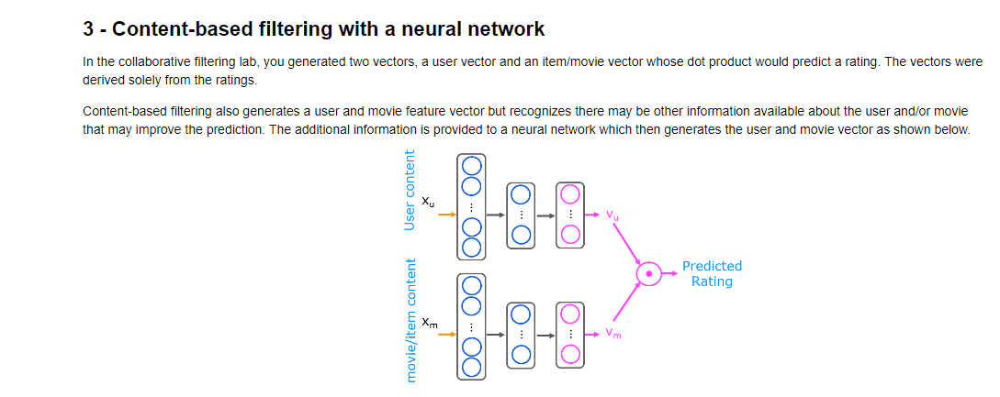
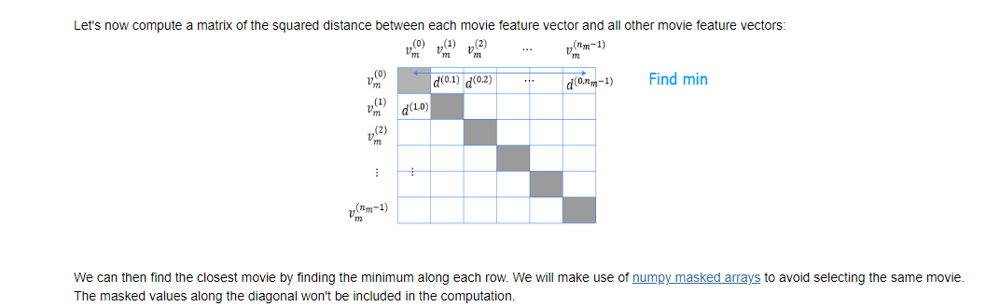

## `Programming Assignment: Deep Learning for Content-Based Filtering`

In this lab, you will implement a content-based collaborative filtering recommender system for movies. This lab will use neural networks to generate the user and movie vectors.

